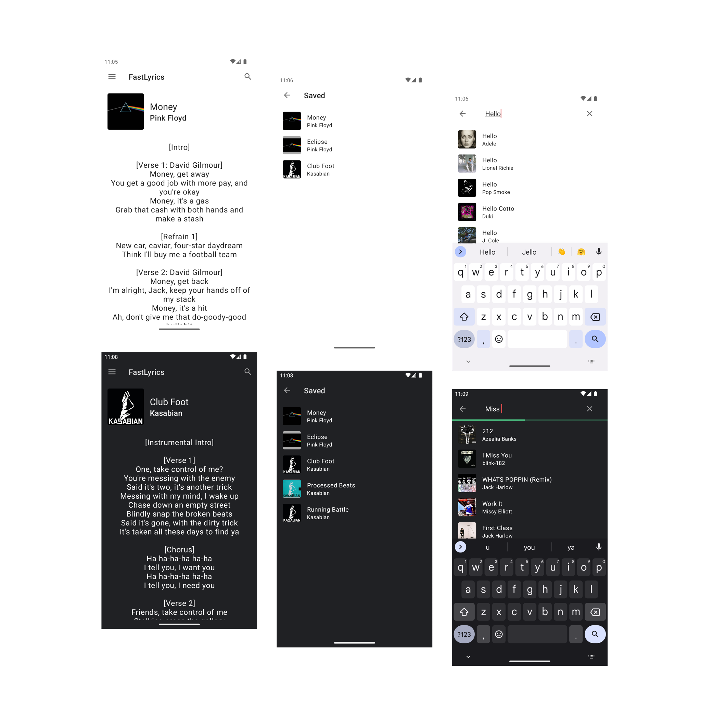

  

# FastLyrics

> How to get lyrics online (fast)

FastLyrics is an app that downloads lyrics for the song, you're listening too. It is mostly a clone of [QuickLyric](https://github.com/QuickLyric/QuickLyric), but more modern and in active development.

## Features
Not all of the features, planned are currently implemented. Here's an overview.

* [x] Getting the song, currently playing on the device
* [x] Fetching lyrics for a playing song
* [x] Saving lyrics for offline use
* [x] Material 1 and 2 Design
* [x] Manual search
* [ ] Nice onboarding UI
* [x] Automatic refresh, once the current song changes

## Screenshots

